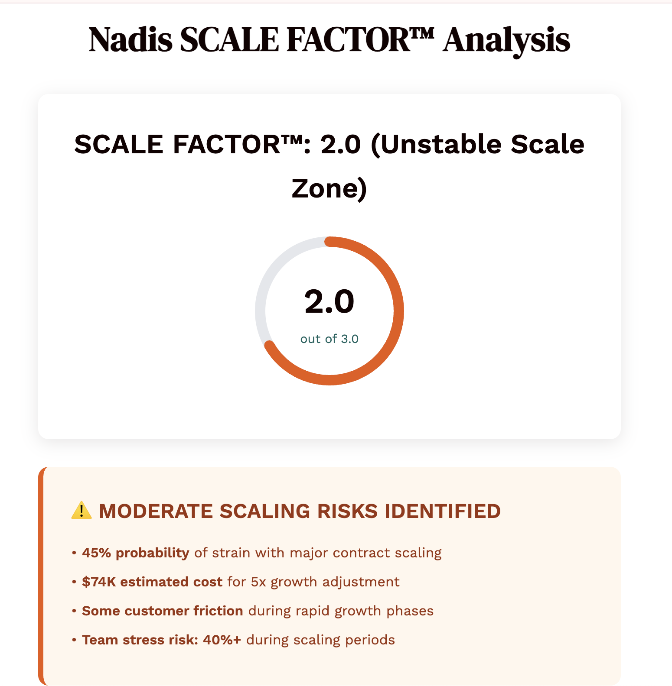
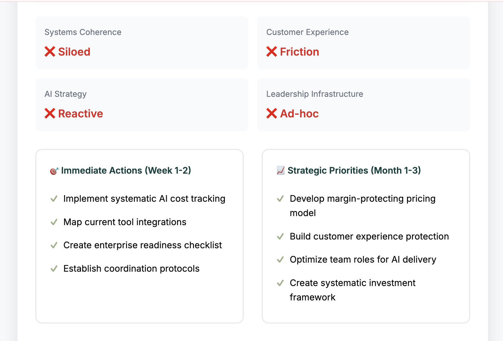
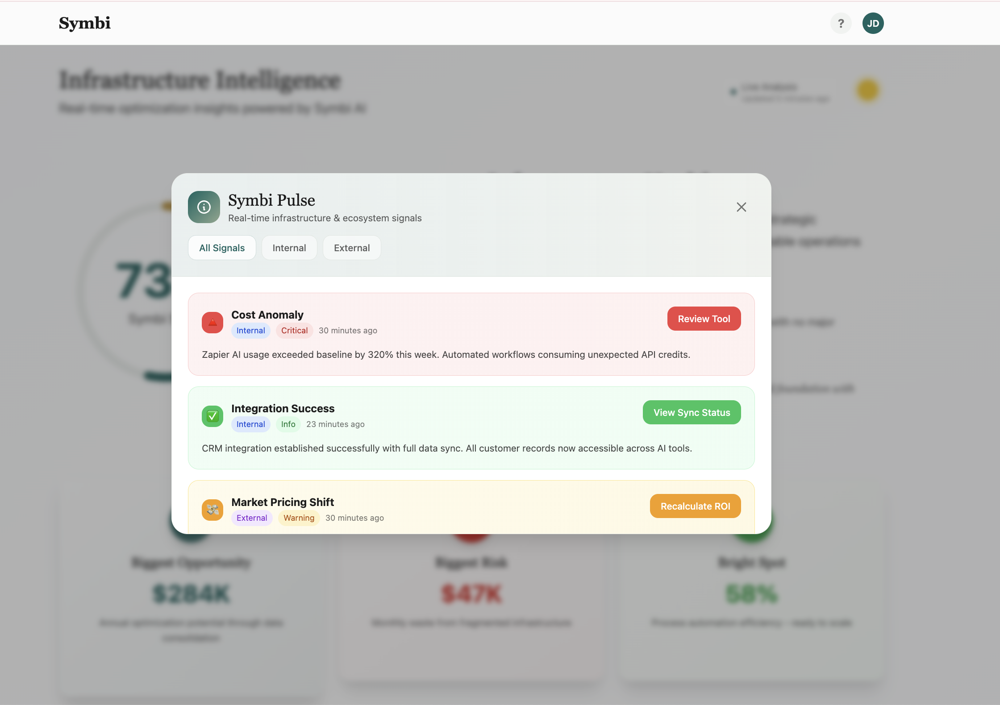
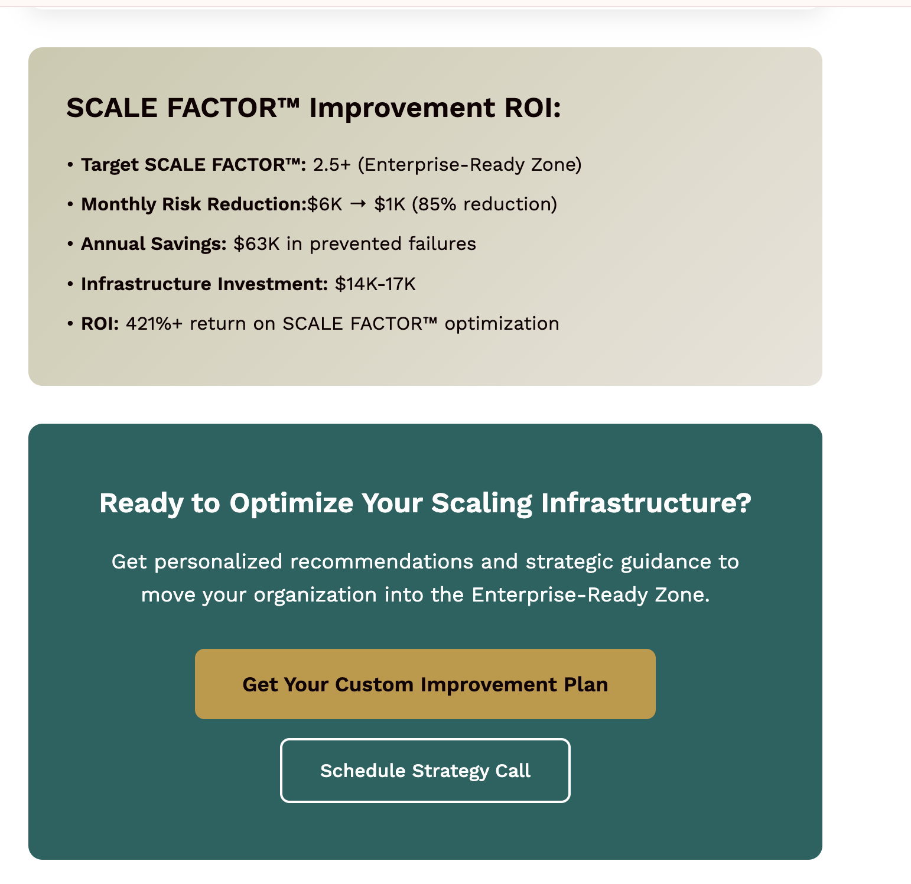

# Building Organizational Intelligence 
### The nervous system for companies that think, sense, and evolve

---

🎥 **[Watch the 3-min Overview](loom-link-here)**  
*(How we're designing the next evolution of organizational systems)*

---

## The Problem I Lived

In 2023, my AI startup crossed $1M ARR—and exposed a structural flaw in how modern companies operate.

We ran 47 tools. Spent $12K/month on overlapping systems. Lost 15 hours/week to friction.  
But it wasn’t just inefficiency. It was incoherence.

> **Organizations today have minds everywhere—but no shared intelligence.**  
> Teams act in isolation. Tools multiply. Strategy fragments.

---

## What We're Building

We’re creating **the intelligence layer for adaptive organizations**—systems that transform scattered signals into coordinated action.

### ✅ Live: SCALE Factor™  
A 5-minute diagnostic for operational intelligence  
→ Measures alignment, efficiency, and infrastructure potential  
[🔗 Try it](https://scalefactor.nadis.ai)

### 🔍 Q4 2025: Symbi™  
A living infrastructure layer  
→ Real-time visibility across people, tools, and decisions  
→ Pattern detection and predictive signals  
→ Alignment insights before friction occurs

### 🌊 2026: ALICE™  
Computing that adapts to how humans think  
→ Ambient, intent-responsive interfaces  
→ Coordinated systems that evolve as you do  
→ Designed to make software disappear into intelligence
→ The end of app-switching and tool management

---

## What the Market Tells Us

From 60+ conversations with founders, COOs, and CTOs:

> “We hire brilliant people, then bury them in disconnected systems.”  
> — SaaS CEO, Series B

> “We’ve bought 30+ tools. Every one makes us slightly less aligned.”  
> — VP Ops, 200-person startup

From SCALE Factor diagnostics:
- Avg. operational coherence: **38%**  
- Avg. waste identified: **$32K/month**  
- **73%** of orgs lack foundational AI infrastructure

---

## Why Now

**The shift is underway.**  
AI made computing adaptive. But most companies are still scaling like it’s 2015.

What’s changing:
- AI tooling has outpaced infrastructure design  
- Remote work decoupled context from coordination  
- Complexity now exceeds human-scale leadership

What’s emerging:
- Infrastructure AS intelligence, not just for intelligence 
- Demand for coherence, not just capability  
- Readiness for ambient, evolving systems

This isn’t about adopting more tools.  
It’s about rearchitecting how organizations think.

---

## Why Me

- **Technical Depth**: DARPA AI finalist, National Science Foundation Grant Winner, Google, AWS, NLP researcher  
- **Operator Reality**: Scaled systems to $1M+ ARR  
- **Pattern Recognition**: Synthesized 60+ exec interviews into product signals  
- **Ecosystem Buildout**: Revenue and traction through SCALE Factor Accelerator

This isn’t a theory. It’s the next layer of systems thinking—grounded in experience.

---

## The Invitation

Join the shift from tools to intelligence:  
- [Diagnose Your Org with SCALE Factor](https://scalefactor.nadis.ai)  
- [Read Our FREE Intelligent Infrastructure Playbook](https://aiwithari.gitbook.io/intelligent-infrastructure/)  
- [Explore Partnership](email ariana.abramson@gmail.com)

---

> “We’re not building smarter tools. We’re building systems that make organizations more intelligent.”  
> — Ariana Abramson, Founder

*The future of leadership isn’t control. It’s coherence.*

---

**Currently welcoming design partners, early backers, and infrastructure thinkers.**
